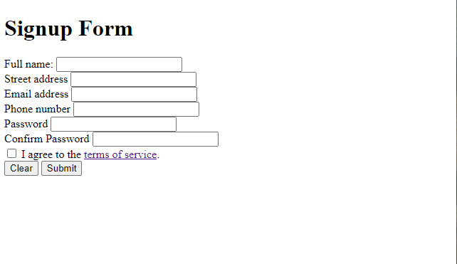

# Exercise 1 - Getting started / HTML

Open `__workshop/exercise-files/index.html` and create all of the required `html` to render the form.

### Things to consider

- You'll need a parent `div`, or _wrapper_ to frame the content.
- Wrap each `label` and `input` in a `div`.
- The terms section will be its own `div` as well`
- Add an empty `div` for the error-message (to be used by the JS)
- Place the 2 buttons in a `footer` element.

Once you're done with that, you should see something like this:

> 🆘 **If you are stuck, or want to compare, you can look at this [hint](./_hints/hint-1.md).**
