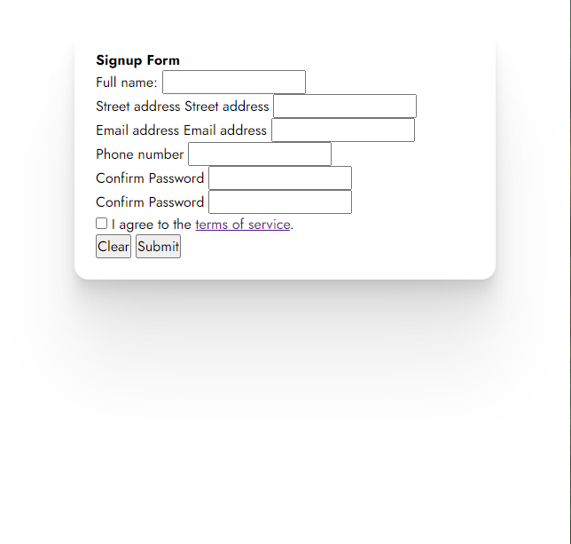

# Exercise 3 - Style it!

## Start with a minor CSS reset to remove browser styling.

```css
* {
  box-sizing: border-box;
  margin: 0;
  padding: 0;
  border: 0;
  font-size: 100%;
  font: inherit;
  vertical-align: baseline;
  font-family: "Jost";
}
```

Note the use of the [Jost font](https://fonts.google.com/specimen/Jost). You will need to import that Google Font into the workshop.

```html
<link
  href="https://fonts.googleapis.com/css?family=Jost:400,700&display=swap"
  rel="stylesheet"
/>
```

## Position the wrapper `div`

- Give that div a `class` of "wrapper".

```html
<body>
  <div class="wrapper">
    <form>...</form>
  </div>
  ...
</body>
```

The form should be centered horizontally on the page. There are many ways to center this `div` on the page. (Totally up to you.)

### Specifics

The form

- should be offset from the top of the screen by `32px`
- should have a max width of `475px`
- should have a padding of `24px` all around
- should have a `white` background
- should have a border radius of `16px`
- should have the following box shadow

```css
box-shadow: 0 2.8px 2.2px rgba(0, 0, 0, 0.02), 0 6.7px 5.3px rgba(0, 0, 0, 0.028),
  0 12.5px 10px rgba(0, 0, 0, 0.035), 0 22.3px 17.9px rgba(0, 0, 0, 0.042),
  0 41.8px 33.4px rgba(0, 0, 0, 0.05), 0 100px 80px rgba(0, 0, 0, 0.07);
```

At this point, your form should look something like this:



Continue styling the html until your version closely matches the screenshot in the main README file.

This is achievable with less than 100 lines of `css`. 😉

### Colors

Here are the colors you'll need:

- Clear button: `hsl(333deg, 100%, 44%)`
- Submit button: `hsl(256deg, 100%, 44%)`
- Page and "terms" background: `#f2f2f2`
- Error message background: `hsla(333deg, 100%, 44%, 0.25)`

### Links

The "terms of service" text should be a link, but we can set the `href` to `"#"`. We don't need a separate page for the terms themselves.


